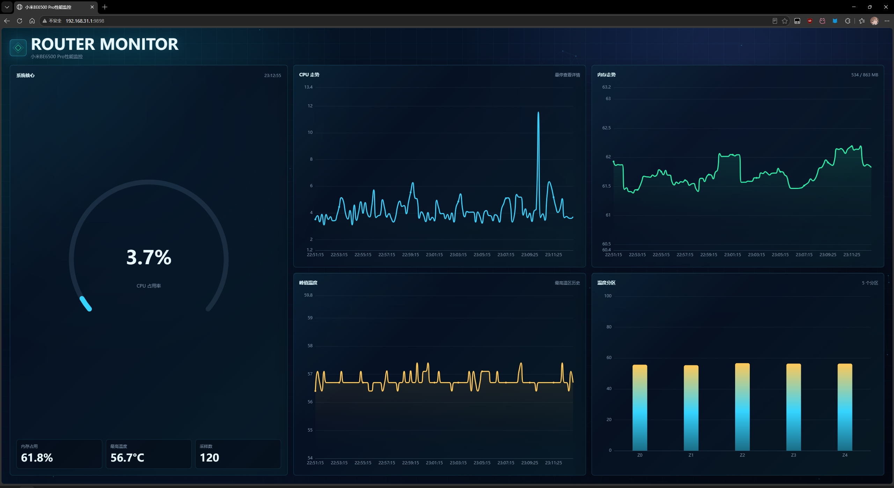
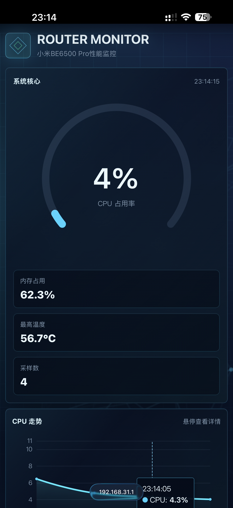

# Mi BE6500 Pro Monitor

English | [简体中文](README.md)

A lightweight performance monitor for SSH-unlocked Xiaomi BE6500 Pro routers.
One static ARM64 binary collects CPU, memory, and thermal data while serving a
JSON API and an embedded responsive web dashboard.

> [!CAUTION]
> This project supports and has only been verified on the Xiaomi BE6500 Pro.
> Other routers may expose different thermal zone counts, sensor names,
> persistent storage paths, and boot mechanisms. Owners of other models must
> review and adapt the source code themselves. Do not install it if you do not
> understand the risks of those differences.

## Features

- Configurable CPU, memory, and thermal zone sampling
- Embedded responsive dark dashboard for desktop and mobile browsers
- Dynamic ECharts timelines, temperature chart, and hover details
- `GET /metrics.json` JSON metrics endpoint
- `GET /health` health endpoint
- Interactive `rmmon` management menu
- Start, stop, restart, logs, interval, and port controls
- Online update checks with GitHub/jsDelivr fallback, SHA-256 verification,
  and automatic rollback
- Xiaomi boot integration and complete uninstallation

## Screenshots

### Desktop browser

<p align="center">
  
</p>

### Mobile browser

<p align="center">
  
</p>

## Requirements

- Xiaomi BE6500 Pro with SSH unlocked and `root` access
- Linux `aarch64`/`arm64`
- A writable `/data/other_vol`
- Access to `raw.githubusercontent.com`
- `curl` or `wget`

The application files are installed under `/data/other_vol/router-monitor`.
When enabled, boot integration and the command alias also use Xiaomi's
`/data/auto_start.sh`, a UCI firewall include, and `/etc/profile`. The
uninstaller removes these entries.

## One-line installation

After signing in to the router over SSH, use GitHub Raw first:

```sh
export url='https://raw.githubusercontent.com/MisakaXeon/Mi-BE6500PRO-Monitor/main' \
  && sh -c "$(curl -kfsSL $url/scripts/install.sh)" \
  && . /etc/profile >/dev/null 2>&1
```

If GitHub Raw is unavailable or unstable on your network, use jsDelivr:

```sh
export url='https://cdn.jsdelivr.net/gh/MisakaXeon/Mi-BE6500PRO-Monitor@main' \
  && sh -c "$(curl -kfsSL $url/scripts/install.sh)" \
  && . /etc/profile >/dev/null 2>&1
```

The installer uses `url` for the binary and all management scripts, so the
entire installation uses jsDelivr with this command. Branch content may be
temporarily stale due to CDN caching; replace `@main` with a published version
tag when an immutable installation source is required.

The installer requires you to type `BE6500PRO` before continuing. It then asks
for the sampling interval, listening port, and whether to start immediately.
Defaults are 10 seconds and TCP port 9898.

## Usage

Open the management menu:

```sh
rmmon
```

Direct commands are also available:

```sh
rmmon status
rmmon metrics
rmmon restart
rmmon log 100
rmmon check-update
rmmon update
```

Open the dashboard or JSON endpoint:

```text
http://ROUTER_IP:9898/
http://ROUTER_IP:9898/metrics.json
```

## Online updates

Use **Check for updates** or **Online update** in `rmmon`, or run the direct
commands above. The updater tries the source recorded during installation,
then deduplicates and falls back between jsDelivr and GitHub Raw. Each attempt downloads one complete release from a
single source and validates every asset against `checksums.txt` before stopping
the running service.

Updates preserve `config.env`, including the listen port, sampling interval,
and preferred update source. A service that was running is restarted; a stopped
service remains stopped. If startup or `/health` fails, the previous release is
restored automatically. An interrupted replacement is also detected and
recovered the next time an update command runs.

Updates are manual and are never checked during boot or in the background.
SHA-256 detects corrupted downloads and inconsistent CDN caches; it does not
replace trust in the GitHub repository itself. Plain HTTP is rejected by
default. `RM_UPDATE_INSECURE=1` is intended only for temporary testing on a
controlled LAN; it also disables HTTPS certificate verification and should not
be stored in persistent configuration.

## Uninstall

Run `rmmon`, select `12. Uninstall`, and type `YES` when prompted.

## Build from source

Go 1.26 or a compatible version is required:

```sh
go test ./...
CGO_ENABLED=0 GOOS=linux GOARCH=arm64 go build \
  -trimpath -ldflags="-s -w -X main.version=$(cat VERSION)" \
  -o bin/router-monitor_linux_arm64 .
sh scripts/generate_checksums.sh
```

The dashboard is compiled into the binary with `go:embed`; no separate static
files are required on the router.

## Security

The service listens on `0.0.0.0` by default and does not authenticate its
metrics endpoint. Use it only on a trusted LAN and never expose its port to the
public Internet. The installer downloads and executes code as root, so review
[`scripts/install.sh`](scripts/install.sh) before running it.

## License

[MIT](LICENSE)
